# Laporan Proyek Machine Learning - Rizka Indah Puspita

## Domain Proyek

### Latar Belakang

Stroke merupakan masalah kesehatan global yang terjadi akibat terhentinya suplai darah ke otak, baik karena sumbatan (stroke iskemik) maupun pecahnya pembuluh darah (stroke hemoragik). Penyakit ini menjadi penyebab kematian tertinggi kedua di negara maju dan ketiga di negara berkembang, dengan sekitar 15 juta kasus baru setiap tahunnya (WHO).[[1]](https://www.news-medical.net/news/20241004/Stroke-remains-a-leading-cause-of-death-globally-with-increased-risk-linked-to-lifestyle-factors.aspx)

Stroke terjadi akibat gangguan aliran darah ke otak, yang dapat disebabkan oleh penyumbatan pembuluh darah (stroke iskemik) atau pecahnya pembuluh darah (stroke hemoragik). Faktor risiko utama stroke meliputi usia, tekanan darah tinggi (hipertensi), diabetes, penyakit jantung, obesitas, merokok, serta pola hidup yang tidak sehat. Deteksi dini sangat penting untuk mencegah komplikasi yang lebih serius, karena penanganan yang cepat dapat meningkatkan peluang pemulihan pasien.[[2]](https://health.detik.com/penyakit/stroke-d-6975174)

Dengan berkembangnya teknologi di bidang kecerdasan buatan (Artificial Intelligence) dan machine learning, berbagai algoritma dapat digunakan untuk memprediksi risiko stroke berdasarkan faktor-faktor kesehatan individu. Beberapa model prediksi seperti K-Nearest Neighbors (KNN), Decision Tree (DT), Random Forest (RF), Support Vector Machine (SVM), Naïve Bayes (NB), dan XGBoost (XGB) telah menunjukkan tingkat akurasi yang tinggi dalam mengidentifikasi potensi stroke pada pasien.[[3]](https://medium.com/%40gloryaanggie/implementasi-metode-random-forest-knn-k-nearest-neighbour-decision-tree-classification-3594ed898206)

## Business Understanding

Stroke merupakan salah satu penyakit yang memiliki dampak besar terhadap kesehatan masyarakat dan sistem layanan kesehatan. Penyakit ini menjadi penyebab utama kecacatan dan kematian di dunia, dengan tingkat kejadian yang terus meningkat akibat pola hidup tidak sehat dan faktor risiko seperti hipertensi, diabetes, penyakit jantung, obesitas, dan merokok.

Deteksi dini stroke sangat penting untuk mengurangi risiko komplikasi dan meningkatkan efektivitas pengobatan. Namun, banyak kasus stroke baru teridentifikasi setelah kondisi pasien memburuk, yang menyebabkan penanganan terlambat dan biaya perawatan yang tinggi. Oleh karena itu, diperlukan model prediksi berbasis data dan machine learning yang dapat membantu dalam mengidentifikasi individu dengan risiko tinggi terkena stroke secara lebih cepat dan akurat.

Dengan penerapan model prediksi ini, rumah sakit, klinik, dan tenaga medis dapat mengoptimalkan strategi pencegahan, memberikan diagnosis yang lebih cepat, serta mengurangi beban ekonomi akibat perawatan jangka panjang bagi pasien stroke.

### Problem Statements

Problem Statements
Berdasarkan latar belakang diatas, permasalahan yang dapat diselesaikan pada proyek ini adalah sebagai berikut:

Saat ini, diagnosis stroke sering dilakukan setelah pasien mengalami gejala yang signifikan, yang mengurangi peluang intervensi dini. Beberapa permasalahan yang dihadapi dalam prediksi stroke adalah:

- Bagaimana cara melakukan pra-pemrosesan data lahan sehingga dapat digunakan untuk membuat model yang baik?
- Bagaimana membangun model machine learning yang dapat memprediksi risiko stroke dengan akurasi tinggi berdasarkan data pasien?
- Algoritma apa yang paling efektif dan optimal dalam mendeteksi risiko stroke?
- Bagaimana model ini dapat membantu tenaga medis dalam memprediksi stroke terhadap pasien?

### Goals
Tujuan dibuatnya proyek ini adalah sebagai berikut :

- Melakukan pra-pemrosesan data preiksi stroke agar dapat digunakan dalam membangun model.
- Mengembangkan model machine learning yang mampu mengklasifikasikan pasien dengan risiko stroke dan non-stroke secara akurat dengan tingkat akurasi > 85%.
-  Membandingkan performa berbagai algoritma seperti K-Nearest Neighbors (KNN), Decision Tree (DT), Random Forest (RF), Support Vector Machine (SVM), Naïve Bayes (NB), dan XGBoost (XGB) dalam mendeteksi risiko stroke.
-  Mengembangkan model yang dapat menganalisis faktor risiko dan mendeteksi potensi stroke lebih awal, sehingga tenaga medis dapat melakukan intervensi sebelum kondisi memburuk.

### Solution Statements
1. Analisis Data untuk Pemahaman Mendalam
- Melakukan univariate dan multivariate analysis untuk memahami pola distribusi data, hubungan antar fitur, serta mengetahui faktor-faktor yang memiliki pengaruh signifikan terhadap risiko stroke.
- Menggunakan visualisasi data seperti heatmap korelasi, boxplot untuk deteksi outlier, dan distribusi fitur untuk memahami tren yang ada dalam dataset.
2. Proses Data Cleaning dan Normalisasi
- Menangani data yang hilang dengan metode imputasi yang sesuai.
- Menghilangkan atau menangani outlier untuk meningkatkan stabilitas model.
- Melakukan normalisasi dan standarisasi fitur agar model lebih optimal dalam melakukan prediksi.
3. Pemilihan dan Pengujian Model Machine Learning
Untuk mendapatkan model terbaik dalam memprediksi stroke, beberapa algoritma machine learning yang akan digunakan adalah:
    - K-Nearest Neighbors (KNN)
    Algoritma berbasis jarak yang mengklasifikasikan data berdasarkan tetangga terdekatnya. KNN dapat membantu dalam mengenali pola pasien dengan karakteristik serupa yang memiliki risiko stroke. [[Referensi]](https://www.geeksforgeeks.org/k-nearest-neighbours/)
    - Decision Tree (DT)
    Algoritma berbasis pohon keputusan yang bekerja dengan membagi data menjadi cabang berdasarkan fitur yang paling berpengaruh terhadap target. Decision Tree mudah diinterpretasikan dan dapat menangani data dengan hubungan non-linear. Namun, algoritma ini rentan terhadap overfitting jika tidak dilakukan pruning. [[Referensi]](https://www.geeksforgeeks.org/decision-tree/)
    - Random Forest (RF)
    Algoritma ensemble yang menggabungkan banyak decision tree untuk meningkatkan akurasi prediksi. Random Forest efektif dalam menangani data dengan banyak variabel dan mengurangi overfitting. [[Referensi]](https://www.geeksforgeeks.org/random-forest-algorithm-in-machine-learning/)
    - Support Vector Machine (SVM)
    Algoritma yang mencari hyperplane optimal untuk memisahkan data dalam ruang multidimensi. SVM cocok untuk menangani dataset dengan distribusi kompleks dalam prediksi stroke. [[Referensi]](https://www.geeksforgeeks.org/support-vector-machine-algorithm/)
    - Naive Bayes (NB)
    Model berbasis probabilitas yang cepat dan efisien untuk klasifikasi. Cocok untuk data medis yang memiliki pola distribusi tertentu berdasarkan faktor risiko stroke. [[Referensi]](https://binus.ac.id/bandung/2019/12/algoritma-naive-bayes/)
    - XGBoost (XGB)
    Algoritma berbasis gradient boosting yang sangat kuat untuk meningkatkan akurasi prediksi. XGBoost sering digunakan dalam kompetisi machine learning karena kemampuannya dalam menangani dataset dengan jumlah fitur yang besar.[[Referensi]](https://www.geeksforgeeks.org/xgboost/)

## Data Understanding

### Deskripsi Variabel
**Informasi Datasets**

| Jenis | Keterangan |
| ------ | ------ |
| Title | Stroke Prediction |
| Source | [Kaggle](https://www.kaggle.com/datasets/fedesoriano/stroke-prediction-dataset/data) |
| Maintainer | [fedesoriano](https://www.kaggle.com/fedesoriano)|
| License | Other (specified in description) |
| Visibility | Publik |
| Tags | Health, Health Condition, Public Health, Health Care  |
| Usability | 10.00 |

Berikut informasi pada dataset:
Menurut Organisasi Kesehatan Dunia (WHO) stroke merupakan penyebab kematian ke-2 di dunia, yang bertanggung jawab atas sekitar 11% dari total kematian. Data yang digunakan dalam pembuatan model merupakan data primer, yang disediakan secara publik di kaggle dengan nama datasets yaitu: healthcare-dataset-stroke-data

| id | gender | age | hypertension | heart_disease | ever_married | work_type | Residence_type | avg_glucose_level | bmi | smoking_status | stroke |
| ------ | ------ |------ | ------ | ------ | ------ |------ | ------ |------ |------ |------ |------ |
|9046 |Male  |67|0|1|Yes|Private      |Urban|228.69|36.6|formerly smoked|1 |
|56669|Male  |81|0|0|Yes|Private      |Urban|186.21|29  |formerly smoked|1 |
|31112|Male  |80|0|1|Yes|Private      |Rural|105.92|32.5|never smoked   |1 |
|60182|Female|49|0|0|Yes|Private      |Urban|171.23|34.4|smokes         |1 |
|1665 |Female|79|1|0|Yes|Self-employed|Rural|174.12|24  |never smoked   |1 |

Tabel 1. Deskripsi Variabel

Dilihat dari _Tabel 1. Deskripsi Variabel_ dataset ini telah di *bersihkan* dan *normalisasi* terlebih dahulu oleh pembuat, sehingga mudah digunakan dan ramah bagi pemula. 
- Dataset berupa CSV (Comma-Seperated Values).
- Dataset memiliki 5110 sample dengan 12 fitur.
- Dataset memiliki 4 fitur bertipe int64,3 fitur bertipe float64 dan 5 fitur bertipe object.
- Terdapat 201 missing value dalam dataset.
### Variable - variable pada dataset
- `id` : Penomoran unik untuk tiap data.
- `gender` : Jenis kelamin individu (Male/Female/Other).
- `age` : Usia pasien.
- `hypertension` : 0 jika pasien tidak memiliki hipertensi, 1 jika pasien memiliki hipertensi.
- `heart_disease` : 0 jika pasien tidak memiliki penyakit jantung, 1 jika pasien memiliki penyakit jantung.
- `ever_married` : Status pernikahan (Yes, No).
- `work_type` : Untuk menunjukkan jenis pekerjaan (Private, Self-employed, Govt_job, Children, Never_worked).
- `Residence_type` : Menunjukkan jenis tempat tinggal (Urban, Rural).
- `avg_glucose_level` : Kadar glukosa rata-rata dalam darah.
- `bmi` : Indeks massa tubuh.
- `smoking_status` : Menunjukkan status merokok seseorang/individu (formerly smoked, never smoked, smokes, Unknown).
- `stroke` : 1 jika pasien mengalami stroke atau 0 jika tidak.
plot_age_bmi_avg-glucose-level.png

### EDA - Univariate Analysis
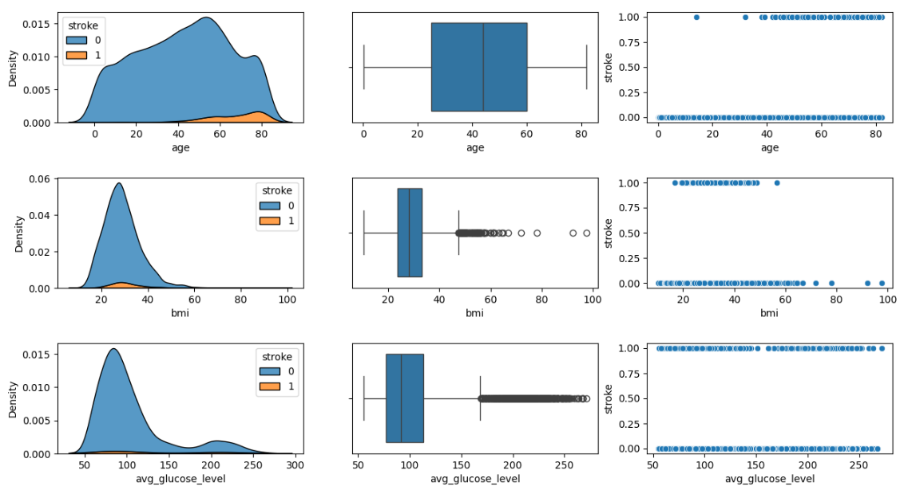

Gambar 1a. Analisis Univariat (Data Numeric) 

Berdasarkan _Gambar 1a_, yang menjadi data numeric pada gambar diatas yaitu age, bmi, avg_glucose_level. berikut penjelasan nya:
- Chart/Plot yang di bagian kiri merupakan visualisasi Distribusi Data (KDE Plot)
- Chart/Plot yang di tengah merupakan visualisasi Boxplot (Deteksi Outlier)
- Chart/Plot yang di bagian kanan merupakan visualisasi Scatter Plot (Hubungan Fitur dengan Stroke)
Faktor usia (age) dan kadar glukosa darah (avg_glucose_level) memiliki hubungan kuat dengan stroke.
- Individu dengan kadar glukosa tinggi (avg_glucose_level) memiliki kemungkinan lebih besar terkena stroke.
- Obesitas (bmi tinggi) mungkin berpengaruh terhadap stroke, tetapi hubungannya tidak terlalu jelas dalam visualisasi ini.

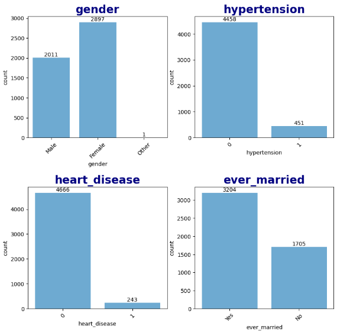
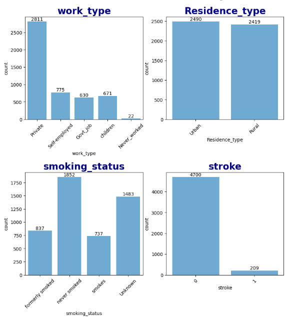

Gambar 2a. Analisis Univariat (Data Categorical)

Berdasarkan _Gambar 2a_, yang menjadi data numeric pada gambar diatas yaitu gender, hypertension, heart_disease, ever_merried, work_type, Residence_type, smoking_status dan stroke. berikut penjelasan nya:
- Pada bar chart gender, Female menduduki peringkat tertinggi dengan total 2897 dan yang terendah Other dengan total 1
- Pada bar chart hypertension banyak pasien tidak memiliki riwayat/penyakit hipertensi dengan total 4458 dan yang memiliki hipertensi dengan total 451
- Pada bar chart heart_disease banyak pasien tidak memiliki riwayat/penyakit jantung dengan total 4666 dan yang memliki penyakit jantung dengan total 243
- Pada bar chart ever_merried banyak pasien yang sudah menikah dengan total 3204 dan yang belum menikah dengan total 1705
- Pada bar chart work_type banyak pasien yang bekerja swasta (Private) dengan total 2811 dan yang terendah belum pernah bekerja (Never_worked) dengan total 22
- Pada bar chart Residence_type banyak pasien yang tinggal di kota (Urban) dengan total 2490 dan yang tinggal di desa dengan total 2419
- Pada bar chart smoking_status banyak pasien yang tdak pernah merokok (never_smoked) dengan total 1854 dan pasien perokok aktif (smokes) dengan total 737
- Pada bar chart stroke banyak pasien yang mempunyai riwayat stroke dengan total 4700 dan yang tidak mempunyai riwayat stroke  dengan total 209
  
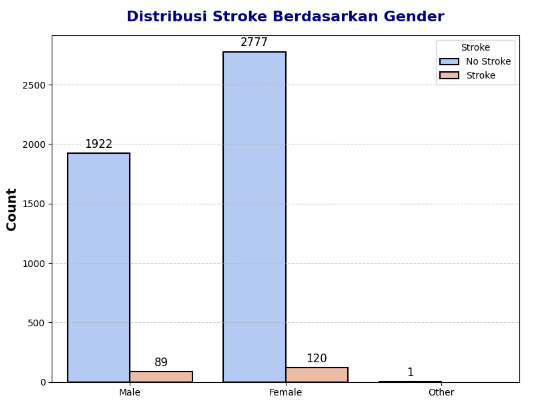

Gambar 3a. Analisis Univariat (Data Distibution Stroke by Gender)

Berdasarkan _Gambar 3a_, pasien Female memiliki penyakit stroke lebih banyak dibandingkan laki-laki. Berikut penjelasan nya:
- Dari data diatas, distirbusi pasien perempuan (Female) yang mengalami stroke lebih banyak dibandingkan dengan laki-laki (Male). Begitu juga untuk pasien perempuan (Female) yg tidak mengalami stroke (No Stroke) sedikit lebih tinggi dibandingkan laki-laki (Male).
- Ada 1 data pasien yang tidak menyebutkan gender nya.

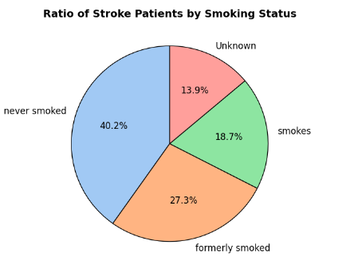

Gambar 4a. Analisis Univariat (Data Ratio Smoking Status)

Berikut penjelasan dari gambar _Gambar 4a_:
*  Sebagian besar pasien stroke tidak pernah merokok (never smoked) dengan rasio 40,2%
*  Beberapa pasien stroke pernah merokok secara intens (formerly smoked) dengan rasio 27,3%
*  Beberapa pasien stroke merokok (smokes) sebelumnya dengan rasio 18,7%
*  Sisanya untuk beberapa pasien, status merokok tidak diketahui (Unknown)

### EDA - Multivariate Analysis

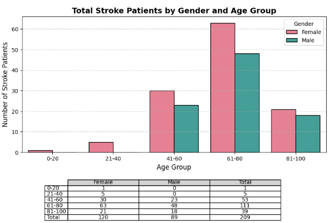

Gambar 1b. Analisis Multivariate (Data Total Stroke Patients by Gender and Age Group)

Kesimpulan dari _Gambar 1b_:
- Risiko stroke meningkat secara signifikan setelah usia 40 tahun, dengan puncaknya di kelompok usia 61-80 tahun.
- Perempuan memiliki jumlah kasus stroke lebih tinggi dibanding laki-laki di hampir semua kelompok usia.
- Jumlah kasus stroke sangat sedikit pada usia muda (0-20 tahun dan 21-40 tahun).
- Setelah usia 80 tahun, jumlah pasien stroke mulai menurun, kemungkinan karena faktor kesehatan dan harapan hidup.

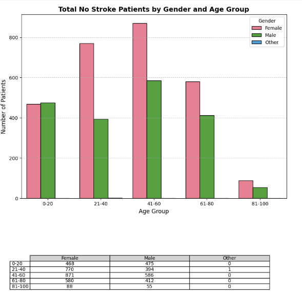

Gambar 2b. Analisis Multivariate (Data No Stroke Total Patients by Gender and Age Group)

Kesimpulan dari _Gambar 2b_:
- Mayoritas pasien tanpa stroke berada dalam kelompok usia 41-60 tahun, dengan jumlah perempuan lebih banyak dibandingkan laki-laki.
- Semakin tua usia, semakin sedikit jumlah pasien yang tidak mengalami stroke. Ini bisa mengindikasikan bahwa risiko stroke meningkat pada usia lanjut.
- Perempuan cenderung memiliki jumlah pasien lebih tinggi dibandingkan laki-laki di setiap kelompok usia.
- Jumlah pasien dengan gender "Other" sangat sedikit, sehingga mungkin tidak cukup signifikan untuk analisis lebih lanjut.
👉 *Implikasi*: Jika jumlah pasien yang tidak mengalami stroke lebih banyak di usia 41-60, mungkin perlu fokus lebih besar pada pencegahan stroke di kelompok usia ini untuk mengurangi risiko di masa depan.

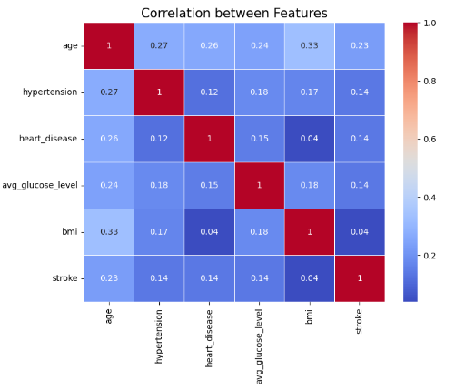

Gambar 3b. Analisis Multivariate (Analisis Matriks Korelasi Fitur)

Pada Gambar 3b. Analisis Multivariate, dengan menggunakan fungsi pairplot dari library seaborn, tampak terlihat relasi pasangan dalam dataset menunjukan pola acak. Pada pola ini faktor yang paling berpengaruh terhadap stroke dalam dataset ini adalah age (0.23). Hipertensi (hypertension), penyakit jantung (heart_disease), dan kadar gula darah (avg_glucose_level) memiliki hubungan yang lemah terhadap stroke (sekitar 0.14). BMI hampir tidak berkorelasi dengan stroke. Tidak ada hubungan yang sangat kuat di antara fitur-fitur ini, menunjukkan bahwa stroke mungkin dipengaruhi oleh kombinasi berbagai faktor dan bukan hanya satu faktor tunggal. .

## Data Preparation

Pada proses _Data Preparation_ dilakukan kegiatan seperti _Data Gathering_, _Data Assessing_, dan _Data Cleaning_. Pada proses Data Gathering, data diimport sedemikian rupa agar bisa dibaca dengan baik menggunakan dataframe Pandas. Untuk proses Data Assessing, berikut adalah beberapa pengecekan yang dilakukan:
- Duplicate data (data yang serupa dengan data lainnya).
- Missing value (data atau informasi yang "hilang" atau tidak tersedia)
- Outlier (data yang menyimpang dari rata-rata sekumpulan data yang ada).

Pada proses _Data Cleaning_ yang dilakukan adalah seperti:
- Converting Column Type (Mengubah tipe suatu kolom).
- Menghapus column atau fitur yang NaN.
- Normalization (mentransformasi data ke dalam skala yang seragam sehingga semua fitur atau atribut memiliki rentang nilai yang sebanding).

| id | gender | age| hypertension| heart_disease| ever_married| work_type| Residence_type| avg_glucose_level | bmi | smoking_status | stroke |
| ---| ------ |--- | ----------- | ------------ | ----------- |--------- | ------------- |------------------ | --- | -------------- |------- |
|51676|Female|61|0|0|Yes|Self-employed|Rural|202.21|N/A|never smoked|1|

Tabel 2. Melihat data missing value

Pada proyek kasus ini tidak ditemukannya data duplikat, tetapi ditemukannya _missing value_. Adapaun metode yang digunakan untuk mengatasi hal ini adalah dengan menerapkan _Dropping_ yaitu menghapus data yang _missing_ digunakannya metode ini dikarenakan jumlah missing value hanya berjumlah `201`. 

Selanjutnya Melakukan Data Preprocessing

Berikut ini merupakan tahapan-tahapan dalam melakukan pra-pemrosesan data :
- Melakukan label encoding pada fitur target (label)
  Sebelum masuk ke tahap pembagian dataset, terlebih dahulu melakukan label endcoding terhadap tipe data kategorikal (gender, ever_married, work_type, Residence_type dan smoking_status). Label Encoding digunakan untuk mengonversi data kategorikal (teks) menjadi format numerik sehingga bisa digunakan dalam algoritma machine learning, yang umumnya hanya bekerja dengan data angka. Pada proyek ini, label encoding dilakukan dengan menggunakan modul [LabelEncoder](https://scikit-learn.org/stable/modules/generated/sklearn.preprocessing.LabelEncoder.html) dari scikit-learn. Contoh pada tabel 3 dapat dilihat data kategorikal sudah berubah menjadi numerik.
  
  |gender | age | hypertension| heart_disease| ever_married| work_type| Residence_type | avg_glucose_level |bmi | smoking_status |	stroke |
  | ------ |--- | ----------- | ------------ | ----------- |--------- | ------------- |------------------ | --- | -------------- |------- |
  |0|1|88|0|1|1|2|1|3734|239|1|1|
  |2|1|101|0|1|1|2|0|2429|198|2|1|
  |3|0|70|0|0|1|2|1|3309|217|3|1|
  |4|0|100|1|0|1|3|0|3318|113|2|1|
  |5|1|102|0|0|1|2|1|3367|163|1|1|

  Tabel 3. Data setelah dilakukan Label Encoding

- Melakukan pembagian dataset
  Untuk mengetahui kinerja model ketika dihadapkan pada data yang belum pernah dilihat sebelumnya maka perlu dilakukan pembagian dataset. Pada proyek ini dataset dibagi menjadi data latih dan data uji dengan rasio 80% untuk data latih dan 20% untuk data uji. Data latih merupakan data yang akan kita   latih untuk membangun model machine learning, sedangkan data uji merupakan data yang belum pernah dilihat oleh model dan digunakan untuk melihat kinerja atau performa dari model yang dilatih. Pembagian dataset dilakukan dengan modul [train_test_split](https://scikit-learn.org/0.24/modules/generated/sklearn.model_selection.train_test_split.html#sklearn.model_selection.train_test_split) dari scikit-learn. Setelah melakukan pembagian dataset, didapatkan jumlah sample pada data latih yaitu 1760 sampel dan jumlah sample pada data uji yaitu 440 sampel dari total jumlah sample pada dataset yaitu 2200 sampel.

- Mengatasi data pencilan (outliers) pada data latih dengan metode LOF (Local Outlier Factor)
  Data pencilan (outliers) merupakan nilai yang tidak normal pada dataset. Adanya data outliers ini akan membuat analisis terhadap serangkaian data menjadi bias, atau tidak mencerminkan fenomena yang sebenarnya sehingga dapat menyebabkan pada pembuatan model menjadi kurang optimal. Oleh karena   itu, untuk menangani ouliers pada proyek ini menerapkan metode Local Outlier Factor untuk mengidentifikasi outliers dan kemudian menghapusnya dari data latih. [LocalOutlierFactor](https://scikit-learn.org/0.24/modules/generated/sklearn.neighbors.LocalOutlierFactor.html#sklearn.neighbors.LocalOutlierFactor), bekerja dengan cara menganalisis nilai lokalitas yang ada pada k-tetangga terdekat, yang jaraknya digunakan untuk memperkirakan kepadatan lokal. Dengan membandingkan kepadatan lokal sampel dengan kepadatan lokal tetangganya, sehingga dapat mengidentifikasi sampel yang memiliki kepadatan jauh lebih rendah daripada tetangganya. Apabila kepadatannya rendah maka ini dianggap sebagai outliers.

- Standardisasi data pada semua fitur numerik pada dataset
  Standardisasi merupakan teknik transformasi yang paling umum digunakan dalam tahap data preparation. Standarisasi membantu untuk membuat semua fitur numerik berada dalam skala data yang sama dan membuat fitur data menjadi bentuk yang lebih mudah diolah oleh algoritma. Pada proyek ini, standarisasi data dilakukan dengan menerapkan teknik StandarScaler dari library Scikitlearn. [StandardScaler](https://scikit-learn.org/stable/modules/generated/sklearn.preprocessing.StandardScaler.html) melakukan proses standarisasi fitur dengan mengurangkan mean (nilai rata-rata) kemudian membaginya dengan standar deviasi untuk menggeser distribusi. StandardScaler menghasilkan distribusi dengan standar deviasi sama dengan 1 dan mean sama dengan 0. Sekitar 68% dari nilai akan berada di antara -1 dan 1.

## Modeling
Pada proyek ini, model yang dibuat merupakan kasus multiclass classification yaitu tugas klasifikasi dengan lebih dari 1 kales. Proses modeling dalam proyek ini menggunakan 6 algoritma machine learning yaitu K-Nearest Neighbor, Desicion Tree, Random Forest, SVM, Naive Bayes dan XGBoost Algorithm kemudian membandingkan performanya.

### _K-Nearest Neighbors (KNN)_
KNN adalah algoritma machine learning yang sederhana dan mudah dipahami untuk klasifikasi dan regresi. Algoritma ini bekerja dengan menemukan k tetangga terdekat dari data baru dan kemudian menggunakan kategori atau nilai rata-rata dari tetangga tersebut untuk memprediksi kategori atau nilai data baru. Adapun parameter yang digunakan pada proyek ini adalah:
  -  `n_neighbors` jumlah tetangga terdekat.
  -  `weight = distance` Tetangga yang lebih dekat memiliki pengaruh lebih besar.
  
  Keunggulan _KNN_ :
  - Dapat digunakan untuk klasifikasi dan regresi.
  - Sederhana dan mudah dipahami.
  
  Kerugian _KNN_ :
  - Sensitif terhadap outlier. 
  - Membutuhkan banyak memori dan waktu komputasi untuk dataset besar. 
  - Sulit untuk memilih nilai K yang optimal.
   
Kemudian proses selanjutnya melakukan prediksi menggunakan data uji dan melakukan pengujian. Hasil pengujian dari model dengan algoritma KNN dapat dilihat pada tabel berikut :

| Accuracy | Precision | Recall | F1-Score |
| -------- | --------- | ------ | -------- |
| 0.9450 | 0.9138 | 0.9450 | 0.9212 |

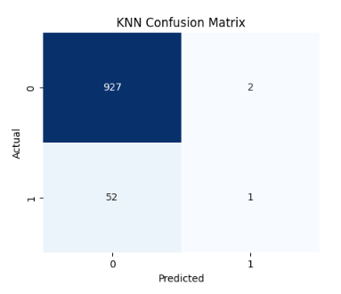

Penjelasan dari Matrix KNN diatas:
- True Negative (TN) = 927
  Model memprediksi negatif (tidak stroke) dengan benar.
- False Positive (FP) = 2
  Model salah memprediksi positif (stroke) padahal sebenarnya negatif.
- False Negative (FN) = 52
  Model salah memprediksi negatif (tidak stroke) padahal sebenarnya positif.
- True Positive (TP) = 1
  Model memprediksi positif (stroke) dengan benar.

### _Decision Tree_ 
Decision Tree adalah algoritma machine learning yang digunakan untuk tugas klasifikasi dan regresi. Algoritma ini bekerja dengan membagi data ke dalam cabang-cabang berdasarkan fitur tertentu hingga mencapai keputusan akhir dalam bentuk daun (leaf nodes). Setiap node dalam pohon keputusan mewakili fitur, setiap cabang mewakili keputusan berdasarkan fitur tersebut, dan setiap leaf node mewakili prediksi akhir.

  Keunggulan Decision Tree:
  - Mudah dipahami dan diinterpretasikan
  - Tidak memerlukan banyak preprocessing data
  - Efektif dalam menangani dataset kecil hingga sedang
  - Dapat menangani hubungan non-linear
  
  Kelemahan Decision Tree:
  - Cenderung overfitting
  - Sensitif terhadap perubahan data
  - Kurang optimal untuk dataset besar

Kemudian proses selanjutnya melakukan prediksi menggunakan data uji dan melakukan pengujian. Hasil pengujian dari model dengan algoritma Desicion Tree dapat dilihat pada tabel berikut :

| Accuracy | Precision | Recall | F1-Score |
| -------- | --------- | ------ | -------- |
| 0.9124 | 0.9075 | 0.9124 | 0.9099 |

Penjelasan dari Matrix Desicion Tree diatas:
- True Negative (TN) = 889
  Model memprediksi negatif (tidak stroke) dengan benar.
- False Positive (FP) = 40
  Model salah memprediksi positif (stroke) padahal sebenarnya negatif.
- False Negative (FN) = 46
  Model salah memprediksi negatif (tidak stroke) padahal sebenarnya positif.
- True Positive (TP) = 7
  Model memprediksi positif (stroke) dengan benar.

### _Random Forest_ 
Random Forest adalah algoritma machine learning ensemble yang menggabungkan beberapa decision tree untuk meningkatkan akurasi prediksi. Algoritma ini bekerja dengan membuat banyak decision tree secara acak dan kemudian menggunakan voting untuk memprediksi kategori atau nilai data baru. Adapun parameter yang digunakan pada proyek ini adalah:
  - `max_depth` kedalaman maksimum.

  Keunggulan _Random Forest_ :
  - Memiliki akurasi prediksi yang tinggi.
  - Mampu menangani dataset dengan dimensi tinggi.
  - Tidak sensitif terhadap outlier.
  
  Kerugian _Random Forest_ :
  - Cenderung overfit pada dataset kecil. 
  - Membutuhkan banyak waktu komputasi untuk pelatihan. 
  - Sulit untuk diinterpretasikan.

Kemudian proses selanjutnya melakukan prediksi menggunakan data uji dan melakukan pengujian. Hasil pengujian dari model dengan algoritma Random Forest dapat dilihat pada tabel berikut :

| Accuracy | Precision | Recall | F1-Score |
| -------- | --------- | ------ | -------- |
| 0.9460 | 0.8950 | 0.9460 | 0.9198 |

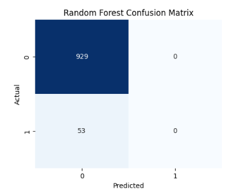

Penjelasan dari Matrix Random Forest diatas:
- True Negative (TN) = 929
  Model memprediksi negatif (tidak stroke) dengan benar.
- False Positive (FP) = 0
  Model salah memprediksi positif (stroke) padahal sebenarnya negatif.
- False Negative (FN) = 53
  Model salah memprediksi negatif (tidak stroke) padahal sebenarnya positif.
- True Positive (TP) = 0
  Model memprediksi positif (stroke) dengan benar.

### _Support Vector Machine (SVM)_ 
SVM adalah algoritma machine learning yang digunakan untuk klasifikasi dan regresi. Algoritma ini bekerja dengan mencari hyperplane yang memisahkan data menjadi dua kelas dengan margin terbesar. Parameter yang digunakan pada SVM kali ini adalah parameter bawaan.
 
   Keuntungan  _Support Vector Machine (SVM)_ :
  - Memiliki akurasi prediksi yang tinggi.
  - Mampu menangani dataset dengan dimensi tinggi.
  - Tidak sensitif terhadap outlier.
  - Dapat digunakan untuk klasifikasi dan regresi.
  
  Kerugian  _Support Vector Machine (SVM)_ :
  - Sulit untuk memilih kernel dan parameter lainnya. 
  - Sensitif terhadap outlier. 
  - Membutuhkan banyak waktu komputasi untuk pelatihan.

Kemudian proses selanjutnya melakukan prediksi menggunakan data uji dan melakukan pengujian. Hasil pengujian dari model dengan algoritma Support Vector Machin dapat dilihat pada tabel berikut :

| Accuracy | Precision | Recall | F1-Score |
| -------- | --------- | ------ | -------- |
| 0.9460 | 0.8950 | 0.9460 | 0.9198 |

Penjelasan dari Matrix SVM diatas:
- True Negative (TN) = 929
  Model memprediksi negatif (tidak stroke) dengan benar.
- False Positive (FP) = 0
  Model salah memprediksi positif (stroke) padahal sebenarnya negatif.
- False Negative (FN) = 53
  Model salah memprediksi negatif (tidak stroke) padahal sebenarnya positif.
- True Positive (TP) = 0
  Model memprediksi positif (stroke) dengan benar.

### _Naïve Bayes Classifier_ 
Naïve Bayes Classifier merupakan sebuah metoda klasifikasi yang berakar pada teorema Bayes. Metode pengklasifikasian dengan menggunakan metode probabilitas dan statistik yang memprediksi peluang di masa depan berdasarkan pengalaman di masa sebelumnya.
 
   Keuntungan _Naïve Bayes Classifier_:
  - Mudah dipahami dan diimplementasikan.
  - Cepat untuk dilatih dan diprediksi
  
  Kerugian _Naïve Bayes Classifier_:
  - Asumsi independensi fitur mungkin tidak selalu valid.
  - Sensitif terhadap fitur dengan nilai nol. 
  - Kinerja dapat menurun dengan dataset yang kompleks.

Kemudian proses selanjutnya melakukan prediksi menggunakan data uji dan melakukan pengujian. Hasil pengujian dari model dengan algoritma Naive Bayes dapat dilihat pada tabel berikut :

| Accuracy | Precision | Recall | F1-Score |
| -------- | --------- | ------ | -------- |
| 0.8921 | 0.9264 | 0.8921 | 0.9070 |

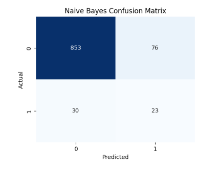

Penjelasan dari Matrix Naive Bayes diatas:
- True Negative (TN) = 853
  Model memprediksi negatif (tidak stroke) dengan benar.
- False Positive (FP) = 76
  Model salah memprediksi positif (stroke) padahal sebenarnya negatif.
- False Negative (FN) = 30
  Model salah memprediksi negatif (tidak stroke) padahal sebenarnya positif.
- True Positive (TP) = 23
  Model memprediksi positif (stroke) dengan benar.

### _XGBoost_ 
XGBoost adalah algoritma machine learning berbasis ensemble learning yang menggunakan metode Gradient Boosting Decision Tree (GBDT). Algoritma ini menggabungkan beberapa decision tree yang lebih lemah secara bertahap untuk membentuk model yang lebih kuat. XGBoost dirancang untuk efisiensi,   kecepatan, dan performa tinggi, menjadikannya pilihan utama dalam berbagai kompetisi machine learning, seperti Kaggle.

  Keunggulan XGBoost:
  - Performa tinggi & akurasi tinggi
  - Efisien dan cepat
  - Mampu menangani missing values
  - Mencegah overfitting
  - Dapat menangani berbagai jenis data
  - Dapat digunakan untuk regresi dan klasifikasi
  
  Kelemahan XGBoost:
  - Kompleksitas tinggi
  - Cukup boros memori
  - Kurang efektif untuk data kecil
  - Membutuhkan preprocessing

Kemudian proses selanjutnya melakukan prediksi menggunakan data uji dan melakukan pengujian. Hasil pengujian dari model dengan algoritma XGBoost dapat dilihat pada tabel berikut :

| Accuracy | Precision | Recall | F1-Score |
| -------- | --------- | ------ | -------- |
| 0.9409 | 0.9120 | 0.9409 | 0.9222 |

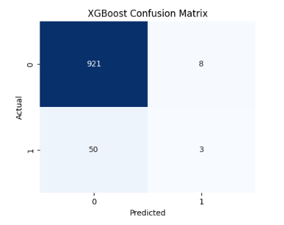

Penjelasan dari Matrix XGBoost diatas:
- True Negative (TN) = 921
  Model memprediksi negatif (tidak stroke) dengan benar.
- False Positive (FP) = 8
  Model salah memprediksi positif (stroke) padahal sebenarnya negatif.
- False Negative (FN) = 50
  Model salah memprediksi negatif (tidak stroke) padahal sebenarnya positif.
- True Positive (TP) = 3
  Model memprediksi positif (stroke) dengan benar.

### Hasil Pengujian Semua Model 

Dari hasil pengujian ke enam model yang telah dibuat, berikut merupakan perbandingan performa antar Model :

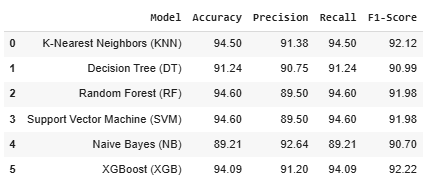

Dari tabel di atas dapat memberikan informasi bahwa ke enam model yang dibangun memiliki nilai akurasi di atas 85%. Dimana dapat dilihat juga bahwa model dengan tingkat performa teratas yaitu Random Forest, Support Vector Machine, dan KNN. Ketiganya sama-sama menghasilkan performa terbaik yang sebagai acuan adalah nilai accuracy, precision, dan recall, dari enam algoritma yang dijadikan model. Disusul oleh algoritma XGBoost dan Desicion Tree yang memiliki nilai performa yang sangat baik. Terakhir, algoritma Naive Bayes (Gaussion NB) memperoleh nilai performa yang kurang baik.

## Evaluation

Pada proyek ini, model yang dibuat merupakan kasus _multiclass classification_ dan metrik evaluasi yang digunakan untuk mengukur kinerja model yaitu menggunakan metrik **akurasi, precision dan recall**. Pada klasifikasi dengan jumlah keluaran kelas yang lebih dari dua (multi-class), cara menghitung akurasi, presisi dan recall dapat dilakukan dengan menghitung rata-rata dari nilai akurasi, presisi dan recall pada setiap kelas. Berikut merupakan formula untuk menghitung nilai akurasi, presisi dan recall dari sistem klasifikasi multi-class (bersumber dari [[here](https://achmatim.net/2017/03/19/mengukur-kinerja-algoritma-klasifikasi-dengan-confusion-matrix/)]) :

- Akurasi
    Akurasi merupakan perbandingan antara data yang terklasifikasi benar dengan keseluruhan data. Nilai akurasi dapat diperoleh dengan persamaan berikut :
  
  

- Precision
    Precision menggambarkan jumlah data kategori positif yang diklasifikasikan secara benar dibagi dengan total data yang diklasifikasi positif. Precision dapat diperoleh dengan persamaan berikut :
  
  

- Recall
    Sementara itu, recall menunjukkan berapa persen data kategori positif yang terklasifikasikan dengan benar oleh sistem. Recall dapat diperoleh dengan persamaan berikut :
  
  

Pada proyek ini, menghitung nilai akurasi, precsion dan recall dilakukan dengan menggunakan modul [accuracy_score](https://scikit-learn.org/stable/modules/generated/sklearn.metrics.accuracy_score.html), [precision_score](https://scikit-learn.org/stable/modules/generated/sklearn.metrics.precision_score.html), [recall_score](https://scikit-learn.org/stable/modules/generated/sklearn.metrics.recall_score.html) dari library Scikitlearn dan menambahkan parameter average = 'macro'.

## _Referensi_
- [1] Vijay Kumar Malesu, (Oct 4 2024) https://www.news-medical.net/news/20241004/Stroke-remains-a-leading-cause-of-death-globally-with-increased-risk-linked-to-lifestyle-factors.aspx.
- [2] https://health.detik.com/penyakit/stroke-d-6975174
- [3] Glorya Debora Anggitha (Jul 1 2024) (https://medium.com/%40gloryaanggie/implementasi-metode-random-forest-knn-k-nearest-neighbour-decision-tree-classification-3594ed898206)
- Wood, T. -.What is a Random Forest?. DeepAI. https://deepai.org/machine-learning-glossary-and-terms/random-forest
- https://binus.ac.id/bandung/2019/12/algoritma-naive-bayes/
- https://www.geeksforgeeks.org/support-vector-machine-algorithm/
- https://www.kaggle.com/code/dmitryuarov/stroke-eda-prediction-with-6-models
- https://www.kaggle.com/code/nimapourmoradi/healthcare-stroke
- https://repository.unism.ac.id/66/4/12%20BAB%20I.pdf